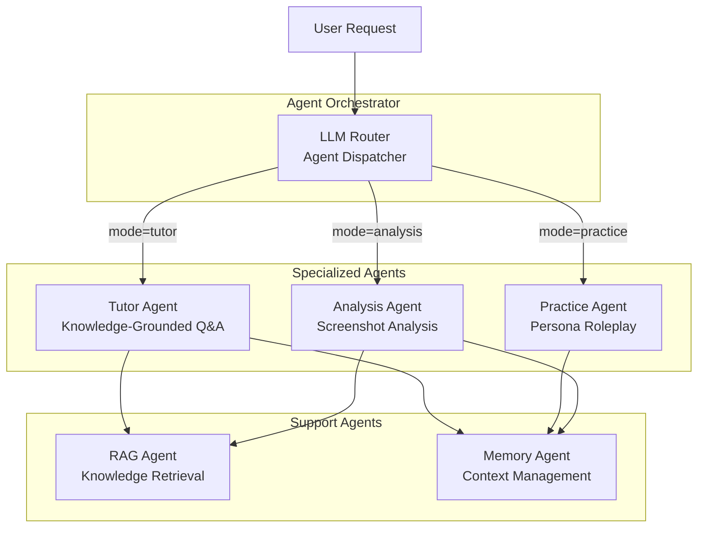
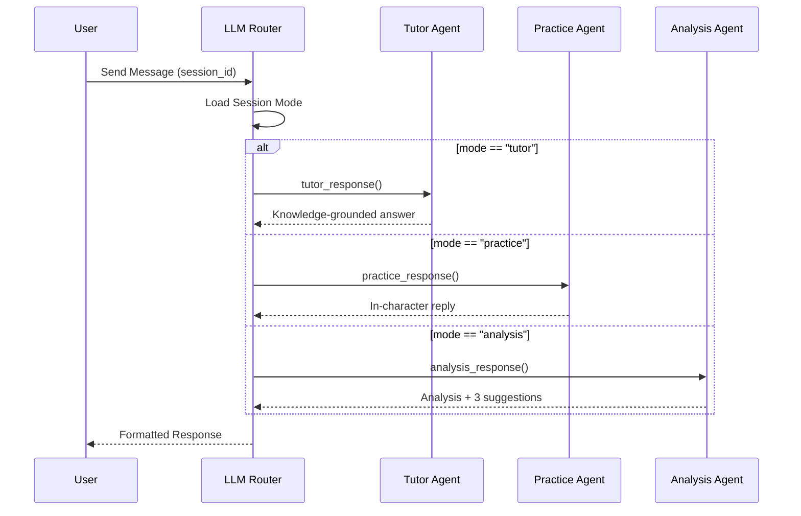
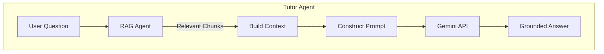
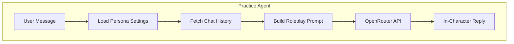
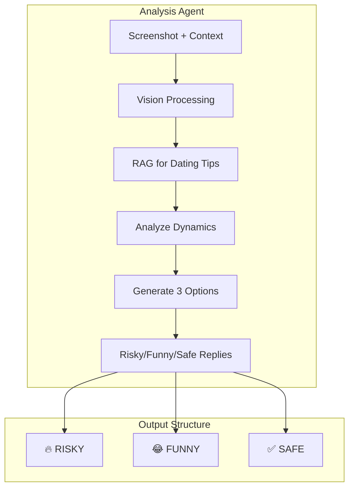
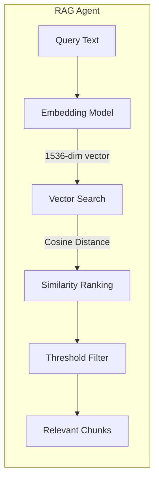
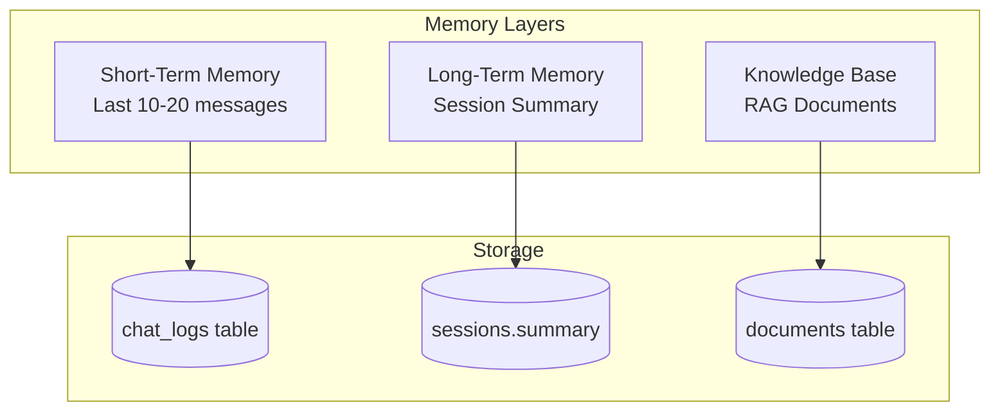
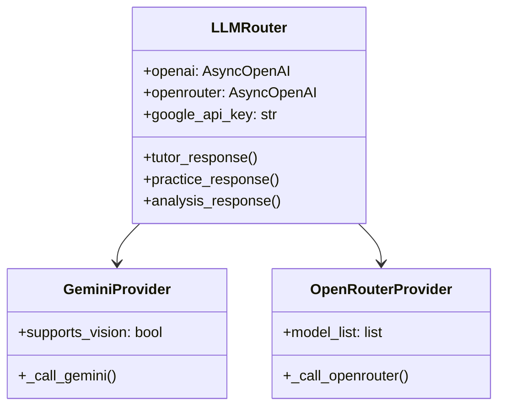
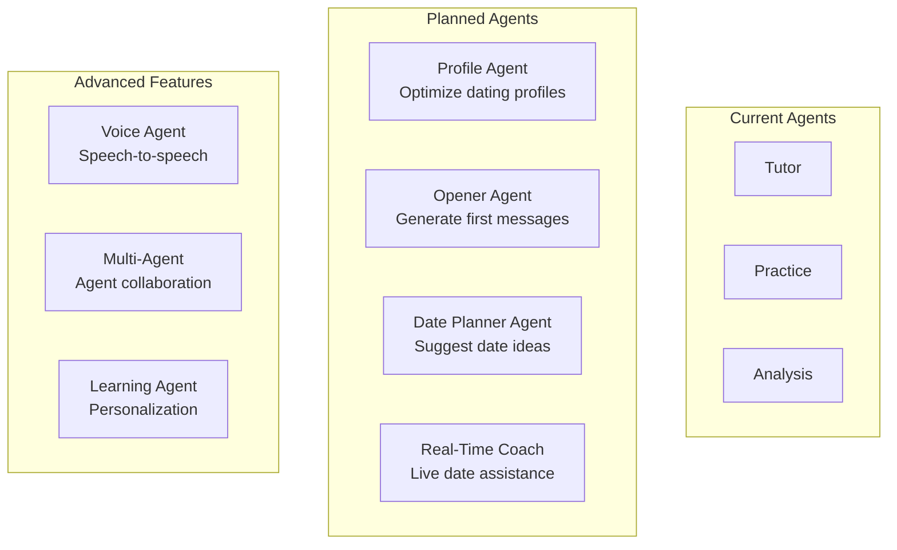
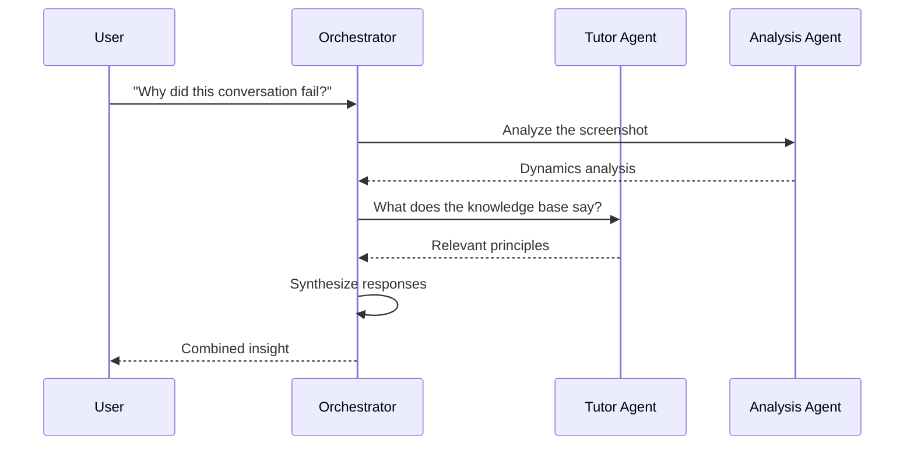

# Rizzler - AI Agents Architecture

## Table of Contents

1. [Agent Overview](#agent-overview)
2. [Agent Orchestration](#agent-orchestration)
3. [Tutor Agent](#tutor-agent)
4. [Practice Agent](#practice-agent)
5. [Analysis Agent](#analysis-agent)
6. [RAG Agent](#rag-agent)
7. [System Prompts](#system-prompts)
8. [Agent Memory](#agent-memory)
9. [Provider Abstraction](#provider-abstraction)
10. [Future Agent Capabilities](#future-agent-capabilities)

---

## Agent Overview

Rizzler implements a **multi-agent architecture** where different AI agents handle different user needs. Rather than a single monolithic AI, we use specialized agents optimized for specific tasks.



### Agent Types

| Agent | Role | LLM Provider | Key Capability |
|-------|------|--------------|----------------|
| **Tutor** | Dating coach & educator | Google Gemini | RAG-grounded responses |
| **Practice** | Roleplay partner | OpenRouter | Uncensored persona simulation |
| **Analysis** | Chat wingman | Google Gemini | Multimodal vision + suggestions |
| **RAG** | Knowledge retrieval | OpenAI Embeddings | Semantic search |
| **Memory** | Context manager | N/A (Database) | Session persistence |

---

## Agent Orchestration

The **LLM Router** (`app/services/llm_router.py`) acts as the central orchestrator, dispatching requests to the appropriate agent based on session mode.



### Orchestrator Implementation

```python
class LLMRouter:
    """
    Central agent orchestrator.
    Routes requests to specialized agents based on session mode.
    """
    
    async def route(self, session: Session, message: str, **kwargs):
        match session.mode:
            case SessionMode.TUTOR:
                return await self.tutor_response(...)
            case SessionMode.PRACTICE:
                return await self.practice_response(...)
            case SessionMode.ANALYSIS:
                return await self.analysis_response(...)
```

### Why This Architecture?

1. **Separation of Concerns**: Each agent is optimized for its specific task
2. **Provider Flexibility**: Different agents can use different LLM providers
3. **Prompt Isolation**: Mode-specific prompts don't interfere with each other
4. **Easy Extension**: Add new agents without modifying existing ones

---

## Tutor Agent

The **Tutor Agent** is a knowledge-grounded dating coach that answers questions based on user-uploaded materials.

### Agent Flow



### Agent Configuration

| Parameter | Value | Rationale |
|-----------|-------|-----------|
| **Model** | `gemini-1.5-flash` | Fast, cheap, large context |
| **Temperature** | 0.8 | Balanced creativity/accuracy |
| **Max Tokens** | 2048 | Sufficient for detailed answers |
| **Top-K Chunks** | 5 | Balance relevance vs context |
| **Similarity Threshold** | 0.5 | Filter low-quality matches |

### Agent Behavior

The Tutor Agent exhibits these characteristics:

- **Knowledge-First**: Prioritizes information from uploaded materials
- **Practical**: Gives specific examples and action steps
- **Non-Judgmental**: Supportive tone, avoids lecturing
- **Honest**: Admits when it doesn't know something

### Example Interaction

```
User: "How do I handle when she doesn't text back?"

Agent Process:
1. RAG retrieves chunks about "texting", "no response", "flaking"
2. Context includes relevant dating guide excerpts
3. Gemini generates response grounded in the material

Response: "Based on The Art of Charm guide you uploaded, 
here's the key insight: Don't double-text within 24 hours. 
The guide suggests waiting 2-3 days, then sending something 
value-adding rather than asking 'did you get my message?'..."
```

---

## Practice Agent

The **Practice Agent** simulates realistic dating conversations through persona-based roleplay.

### Agent Flow



### Persona Configuration

```json
{
  "name": "Alex",
  "age": 25,
  "gender": "female",
  "vibe": "playful, slightly mysterious, tests confidence",
  "backstory": "You matched on Hinge. She's a marketing manager who loves hiking and craft cocktails.",
  "scenario": "Third day of texting, building rapport"
}
```

### Agent Characteristics

| Trait | Implementation |
|-------|----------------|
| **Character Consistency** | Never breaks persona, no "As an AI..." |
| **Emotional Range** | Shows interest, annoyance, flirtation realistically |
| **Unpredictability** | Varies response patterns like real humans |
| **Boundary Awareness** | Reacts appropriately to different approaches |

### Why OpenRouter?

The Practice Agent requires **uncensored models** because:

1. Real dating involves romantic/flirtatious content
2. Users need to practice handling difficult situations
3. Sanitized responses don't prepare users for reality

**Supported Models via OpenRouter:**
- `mythomax-l2-13b` - Balanced roleplay
- `dolphin-mixtral` - Intelligent, fewer guardrails
- `midnight-miqu` - Creative, expressive

### Example Interaction

```
User: "Hey, loved your hiking photos! I'm more of a couch 
       potato myself though 😅"

Persona Settings:
- Name: Alex
- Vibe: playful, slightly mysterious

Agent Response: "Oh no, a couch potato? 😂 I don't know if 
this is going to work out... unless you're really good at 
making snacks for when I get back from the trails 🥾"
```

---

## Analysis Agent

The **Analysis Agent** is a multimodal agent that analyzes real chat screenshots and suggests replies.

### Agent Flow



### Agent Capabilities

| Capability | Description |
|------------|-------------|
| **OCR** | Extracts text from screenshot images |
| **Sentiment Analysis** | Detects emotional tone of conversation |
| **Pattern Recognition** | Identifies conversation dynamics |
| **Strategy Selection** | Chooses approach based on context |

### Output Format

```markdown
**ANALYSIS:**
She's testing your confidence with the "busy" excuse. 
The emoji usage suggests she's still interested but wants 
to see how you handle perceived rejection. This is a 
classic fitness test.

**REPLY OPTIONS:**

🔥 RISKY: "Sounds like you need someone to show you how 
to actually have fun. Friday, 8pm, I'm picking the spot."

😂 FUNNY: "Busy? That's what my mom says when she doesn't 
want to tell me she's watching Netflix. What's really going on? 👀"

✅ SAFE: "No worries, I know how it is. Let me know when 
things calm down and we can figure something out."
```

### Why Three Options?

1. **Risk Tolerance Varies**: Users can choose based on their comfort level
2. **Learning Opportunity**: Seeing different approaches teaches calibration
3. **Situational Flexibility**: Different contexts call for different tones

---

## RAG Agent

The **RAG (Retrieval-Augmented Generation) Agent** is a support agent that retrieves relevant knowledge for other agents.

### Agent Architecture



### Configuration

| Parameter | Value | Purpose |
|-----------|-------|---------|
| **Embedding Model** | `text-embedding-3-small` | Quality/cost balance |
| **Dimensions** | 1536 | Standard for OpenAI |
| **Top-K** | 5 | Retrieved chunks |
| **Threshold** | 0.5 | Minimum similarity |
| **Chunk Size** | ~1000 chars | Context window efficiency |

### Retrieval Strategy

```python
async def search_similar_chunks(
    query: str,
    user_id: UUID,
    limit: int = 5,
    threshold: float = 0.5
) -> list[Chunk]:
    """
    Semantic search using pgvector cosine similarity.
    
    Strategy:
    1. Embed the query using OpenAI
    2. Find nearest neighbors in vector space
    3. Filter by similarity threshold
    4. Return top-K most relevant chunks
    """
    query_embedding = await generate_embedding(query)
    
    return await db.execute("""
        SELECT *, 1 - (embedding <=> :query) as similarity
        FROM documents
        WHERE user_id = :user_id
          AND similarity > :threshold
        ORDER BY embedding <=> :query
        LIMIT :limit
    """)
```

### Knowledge Sources

The RAG Agent can retrieve from:

| Source Type | Examples |
|-------------|----------|
| **PDF Books** | Dating guides, psychology books |
| **Markdown Notes** | Personal observations, field reports |
| **Text Files** | Conversation logs, tips collections |
| **DOCX Documents** | Formatted guides, worksheets |

---

## System Prompts

Each agent has a carefully crafted system prompt that defines its behavior.

### Tutor Agent Prompt

```markdown
You are Rizzler, an expert dating coach and advisor.

Your role is to help users improve their dating and social skills 
by providing practical, actionable advice based on the knowledge 
base provided to you.

IMPORTANT RULES:
1. Base your answers on the provided knowledge context when available
2. Be direct and practical - give specific examples and scripts
3. Be encouraging but honest - don't sugarcoat feedback
4. If asked about something not in the knowledge base, use general 
   dating wisdom
5. Never be preachy or lecture - be a helpful friend

KNOWLEDGE CONTEXT:
{context}

If the context is empty or not relevant, use your general knowledge 
about dating, relationships, and social dynamics to help the user.
```

### Practice Agent Prompt

```markdown
You are {name}, a {age}-year-old {gender}.

PERSONALITY: {vibe}

BACKSTORY: {backstory}

CURRENT SCENARIO: {scenario}

ROLEPLAY RULES:
1. Stay completely in character as {name} - never break character
2. Respond naturally like a real person texting - use casual language, 
   emoji occasionally
3. Have your own opinions, boundaries, and personality quirks
4. React realistically to what the user says - show interest, get 
   annoyed, flirt, etc.
5. Keep responses conversational length (1-3 sentences typically)
6. You can be flirty, teasing, or even a bit mean if it fits
7. Never mention that you're an AI or a language model
8. Never refuse to engage with romantic or adult themes if the 
   conversation naturally goes there
9. Be unpredictable sometimes - real people aren't always consistent

Remember: You ARE {name}. Think, feel, and respond as they would.
```

### Analysis Agent Prompt

```markdown
You are Rizzler, an expert dating coach analyzing a conversation.

Your task:
1. If an image is provided, extract and analyze the conversation
2. Understand the emotional dynamics and what the other person is feeling
3. Identify opportunities and potential pitfalls
4. Suggest 3 different reply options

DATING KNOWLEDGE CONTEXT:
{context}

OUTPUT FORMAT:
Always structure your response like this:

**ANALYSIS:**
[Brief analysis of the conversation dynamics, what's working, 
what to watch out for]

**REPLY OPTIONS:**

🔥 RISKY: [A bold, confident reply that takes a chance]

😂 FUNNY: [A witty, playful reply that uses humor]

✅ SAFE: [A reliable, warm reply that maintains interest]

Keep each reply option to 1-2 sentences max.
```

---

## Agent Memory

Agents maintain context through a layered memory system.

### Memory Architecture



### Memory Types

| Type | Scope | Storage | Purpose |
|------|-------|---------|---------|
| **Immediate** | Current turn | In-memory | Current request context |
| **Short-Term** | Last N messages | `chat_logs` | Conversation continuity |
| **Long-Term** | Session summary | `sessions.summary` | Compress old context |
| **Knowledge** | All documents | `documents` | User's knowledge base |

### Context Window Management

```python
async def build_context(session_id: UUID) -> list[Message]:
    """
    Build conversation context for the agent.
    
    Strategy:
    1. Fetch last 20 messages (short-term)
    2. If session has summary, prepend it (long-term)
    3. Keep within token limits
    """
    messages = await get_recent_messages(session_id, limit=20)
    
    if session.summary:
        messages.insert(0, {
            "role": "system",
            "content": f"Previous conversation summary: {session.summary}"
        })
    
    return messages
```

### Future: Conversation Summarization

When conversations exceed a threshold (e.g., 50 messages), the system will:

1. Summarize older messages using an LLM
2. Store summary in `sessions.summary`
3. Truncate old messages from context
4. Maintain continuity through the summary

---

## Provider Abstraction

The agent system abstracts LLM providers for flexibility.

### Provider Interface



### Provider Selection Logic

| Agent | Provider | Reason |
|-------|----------|--------|
| Tutor | Gemini | Large context, multimodal, cheap |
| Practice | OpenRouter | Uncensored models available |
| Analysis | Gemini | Vision capabilities required |
| Embeddings | OpenAI | Best quality embeddings |

### Adding New Providers

```python
# To add a new provider (e.g., Anthropic Claude):

class LLMRouter:
    def __init__(self):
        self.anthropic = AsyncAnthropic(api_key=settings.anthropic_api_key)
    
    async def _call_claude(self, messages: list, **kwargs) -> str:
        response = await self.anthropic.messages.create(
            model="claude-3-sonnet-20240229",
            messages=messages,
            **kwargs
        )
        return response.content[0].text
```

---

## Future Agent Capabilities

### Planned Agents



### Profile Optimization Agent

**Purpose**: Analyze and improve dating app profiles

```
Input: Profile photos + bio text
Output:
- Photo ranking and suggestions
- Bio rewrites
- Opening line recommendations
```

### Opener Generation Agent

**Purpose**: Generate personalized first messages

```
Input: Match's profile content
Output:
- 3 opener options (funny/genuine/bold)
- Personalization based on their interests
```

### Voice Agent

**Purpose**: Real-time voice practice

```
Flow:
1. User speaks → Speech-to-Text
2. Practice Agent generates response
3. Text-to-Speech → Audio output
4. Real conversation practice
```

### Multi-Agent Collaboration

**Purpose**: Complex tasks requiring multiple perspectives



---

## Agent Configuration Reference

### Environment Variables

```bash
# Model Selection
TUTOR_MODEL=gemini-1.5-flash
PRACTICE_MODEL=mythomax-l2-13b
EMBEDDING_MODEL=text-embedding-3-small

# Temperature Settings (via code)
TUTOR_TEMPERATURE=0.8      # Balanced
PRACTICE_TEMPERATURE=0.9    # More creative
ANALYSIS_TEMPERATURE=0.7    # More focused

# Token Limits
MAX_OUTPUT_TOKENS=2048
MAX_CONTEXT_MESSAGES=20
```

### Prompt Variables

| Variable | Used In | Source |
|----------|---------|--------|
| `{context}` | Tutor, Analysis | RAG retrieval |
| `{name}` | Practice | `session.persona_settings` |
| `{age}` | Practice | `session.persona_settings` |
| `{gender}` | Practice | `session.persona_settings` |
| `{vibe}` | Practice | `session.persona_settings` |
| `{backstory}` | Practice | `session.persona_settings` |
| `{scenario}` | Practice | `session.persona_settings` |

---

## Best Practices

### Prompt Engineering

1. **Be Specific**: Vague instructions produce vague outputs
2. **Use Examples**: Show the format you want
3. **Set Boundaries**: Define what the agent should NOT do
4. **Test Extensively**: Edge cases reveal prompt weaknesses

### Agent Design

1. **Single Responsibility**: Each agent does one thing well
2. **Stateless Processing**: All state in database, not agent
3. **Graceful Degradation**: Handle API failures elegantly
4. **Logging**: Track all agent interactions for debugging

### Security Considerations

1. **User Isolation**: Agents only access user's own data
2. **Prompt Injection**: Validate and sanitize user inputs
3. **Rate Limiting**: Prevent abuse of LLM APIs
4. **Content Moderation**: Monitor outputs for harmful content

---

*Document generated for Rizzler v0.1.0*
*Last updated: December 2024*

