# Rizzler - System Architecture & Design Documentation

## Table of Contents

1. [Overview](#overview)
2. [System Architecture](#system-architecture)
3. [Technology Stack](#technology-stack)
4. [Project Structure](#project-structure)
5. [Data Models](#data-models)
6. [API Design](#api-design)
7. [Core Services](#core-services)
8. [Authentication Flow](#authentication-flow)
9. [The Three Modes](#the-three-modes)
10. [RAG Pipeline](#rag-pipeline)
11. [Deployment Architecture](#deployment-architecture)
12. [Design Decisions](#design-decisions)

---

## Overview

**Rizzler** is an AI-powered dating coach application with three distinct modes:

| Mode | Purpose | LLM Provider |
|------|---------|--------------|
| **Tutor** | Learn from uploaded dating guides via RAG | Google Gemini |
| **Practice** | Roleplay conversations with AI personas | OpenRouter (uncensored) |
| **Analysis** | Get reply suggestions for real chat screenshots | Google Gemini (vision) |

### Core Differentiators

- **Context-Aware**: Uses RAG to ground responses in user-uploaded knowledge
- **Persistent Memory**: Sessions span days/devices via PostgreSQL
- **Uncensored Practice**: OpenRouter provides realistic roleplay without sanitization
- **Multimodal**: Vision capabilities for screenshot analysis

---

## System Architecture

### High-Level Architecture

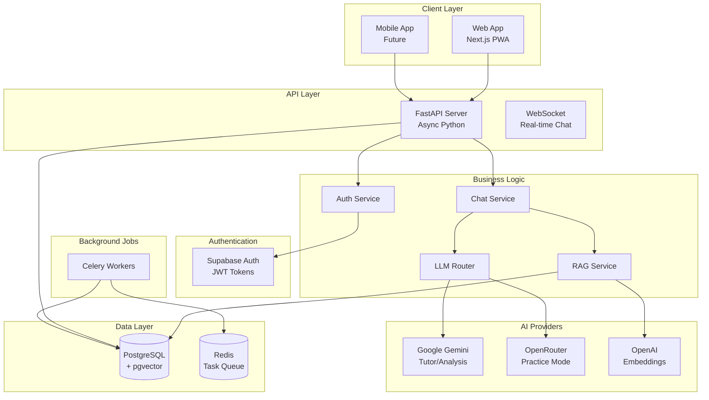

### Request Flow

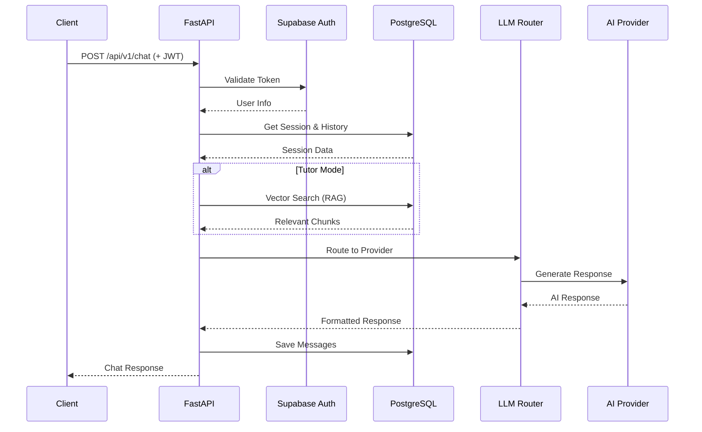

---

## Technology Stack

### Backend

| Component | Technology | Why |
|-----------|------------|-----|
| **Framework** | FastAPI | Async-native, automatic OpenAPI docs, type hints |
| **Database** | PostgreSQL + Supabase | Managed hosting, built-in auth, realtime |
| **Vector Store** | pgvector | No separate vector DB needed, SQL integration |
| **ORM** | SQLAlchemy 2.0 | Async support, type-safe queries |
| **Task Queue** | Celery + Redis | Background document processing |
| **Auth** | Supabase Auth | Managed JWT, social logins, no custom auth code |

### AI/LLM

| Component | Technology | Why |
|-----------|------------|-----|
| **Embeddings** | OpenAI text-embedding-3-small | Best quality/cost ratio, 1536 dimensions |
| **Tutor/Analysis** | Google Gemini 1.5 Flash | Cheap, huge context, multimodal |
| **Practice** | OpenRouter (Mythomax, Dolphin) | Uncensored models for realistic roleplay |

### Deployment

| Component | Technology | Why |
|-----------|------------|-----|
| **Container** | Docker | Portable, consistent environments |
| **Hosting** | Coolify/Render/Railway | Deployment-agnostic design |
| **Config** | Pydantic Settings | Type-safe, env-based configuration |

---

## Project Structure

```
rizzler/
├── app/                          # Main application package
│   ├── __init__.py               # Package init with version
│   ├── config.py                 # Pydantic Settings (env config)
│   ├── database.py               # SQLAlchemy + Supabase clients
│   ├── main.py                   # FastAPI app entry point
│   │
│   ├── models/                   # SQLAlchemy ORM models
│   │   ├── __init__.py           # Export all models
│   │   ├── base.py               # Base model with id, timestamps
│   │   ├── user.py               # User profile & preferences
│   │   ├── session.py            # Chat sessions with mode
│   │   ├── document.py           # RAG document chunks
│   │   └── chat.py               # Chat message history
│   │
│   ├── routers/                  # API endpoint handlers
│   │   ├── __init__.py           # Export all routers
│   │   ├── auth.py               # Login, register, JWT handling
│   │   ├── sessions.py           # Session CRUD operations
│   │   ├── chat.py               # Send/receive messages
│   │   └── upload.py             # Document upload & RAG
│   │
│   ├── services/                 # Business logic layer
│   │   ├── __init__.py           # Export all services
│   │   ├── llm_router.py         # Multi-provider LLM abstraction
│   │   ├── rag_service.py        # Vector search & embeddings
│   │   └── document_service.py   # Text extraction & chunking
│   │
│   └── workers/                  # Background task processing
│       ├── __init__.py
│       ├── celery_app.py         # Celery configuration
│       └── document_processor.py # Async document processing
│
├── scripts/                      # Utility scripts
│   ├── init_db.py                # Database initialization
│   └── init-db.sql               # PostgreSQL extensions
│
├── docs/                         # Documentation
│   └── ARCHITECTURE.md           # This file
│
├── Dockerfile                    # Production container
├── docker-compose.yml            # Local development stack
├── requirements.txt              # Python dependencies
└── README.md                     # Quick start guide
```

---

## Data Models

### Entity Relationship Diagram

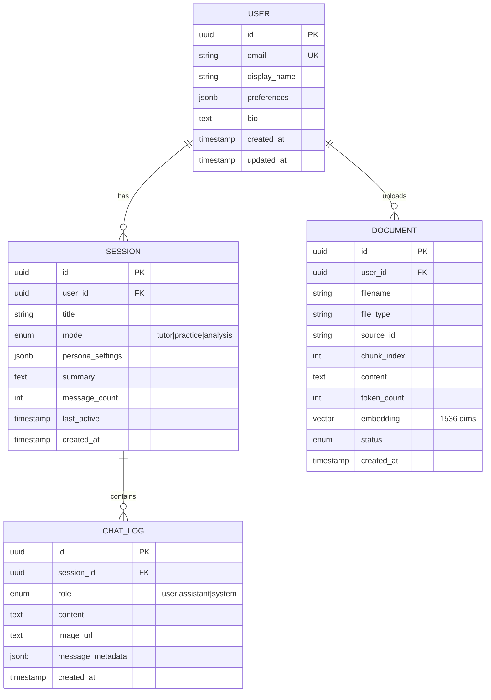

### Model Descriptions

#### User
- **Purpose**: Store user profile and preferences
- **Integration**: ID matches Supabase Auth user ID for seamless auth
- **Key Fields**:
  - `preferences`: JSONB for flexible settings (goals, style)
  - `bio`: User's dating bio for AI context

#### Session
- **Purpose**: Represent a conversation context that persists
- **Key Fields**:
  - `mode`: Determines which LLM and prompt to use
  - `persona_settings`: For Practice mode (name, age, vibe, backstory)
  - `summary`: AI-generated summary for context compression

#### Document
- **Purpose**: Store chunked knowledge base content with embeddings
- **Key Fields**:
  - `source_id`: Groups chunks from same uploaded file
  - `embedding`: pgvector column for semantic search
  - `status`: Track processing state (pending → completed)

#### ChatLog
- **Purpose**: Store conversation history
- **Key Fields**:
  - `image_url`: For Analysis mode screenshots
  - `message_metadata`: Token usage, RAG sources, model info

---

## API Design

### Endpoint Overview

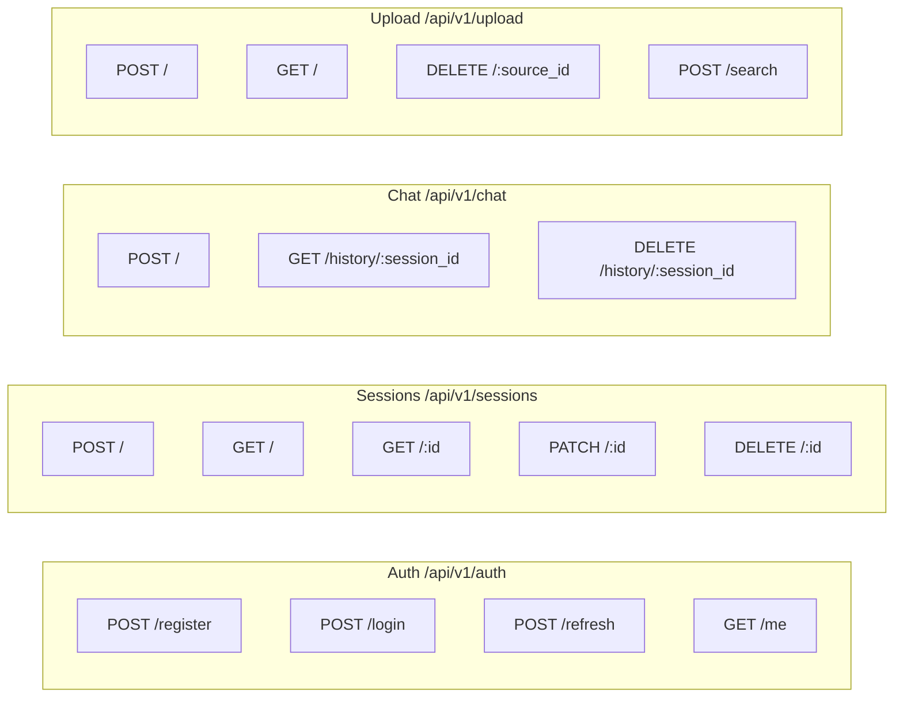

### Key Endpoints

| Endpoint | Method | Description | Auth |
|----------|--------|-------------|------|
| `/api/v1/auth/register` | POST | Create new user | No |
| `/api/v1/auth/login` | POST | Get JWT tokens | No |
| `/api/v1/sessions` | POST | Create chat session | Yes |
| `/api/v1/chat` | POST | Send message, get AI response | Yes |
| `/api/v1/upload` | POST | Upload document for RAG | Yes |
| `/api/v1/upload/search` | POST | Search knowledge base | Yes |

---

## Core Services

### LLM Router (`app/services/llm_router.py`)

The LLM Router is the brain of the application - it intelligently routes requests to different AI providers based on the session mode.

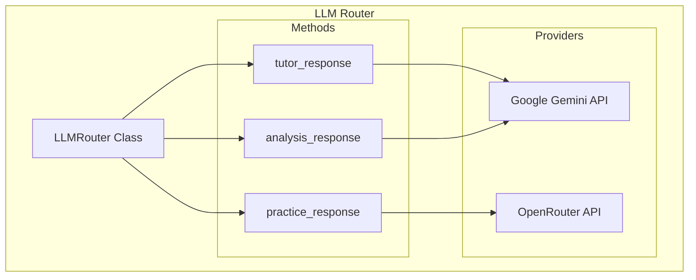

**Why this design?**
- Single abstraction layer for all LLM calls
- Easy to add new providers or switch models
- Mode-specific prompt engineering in one place
- Consistent error handling and response formatting

### RAG Service (`app/services/rag_service.py`)

Handles vector search and embedding generation for the Tutor mode.

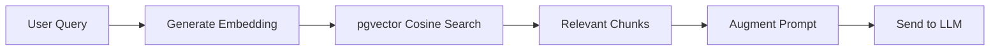

**Key Functions**:
- `generate_embedding()`: Create 1536-dim vectors via OpenAI
- `search_similar_chunks()`: SQL-based cosine similarity search

### Document Service (`app/services/document_service.py`)

Processes uploaded files into searchable chunks.

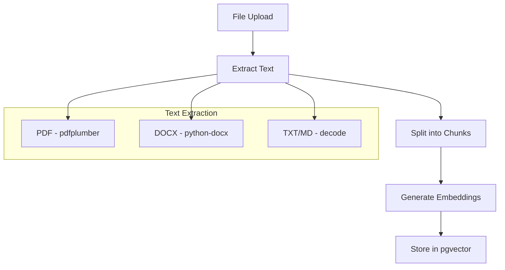

**Processing Pipeline**:
1. Extract text (PDF, DOCX, TXT, MD supported)
2. Chunk with ~1000 char size, 200 char overlap
3. Generate embeddings for each chunk
4. Store in PostgreSQL with pgvector

---

## Authentication Flow

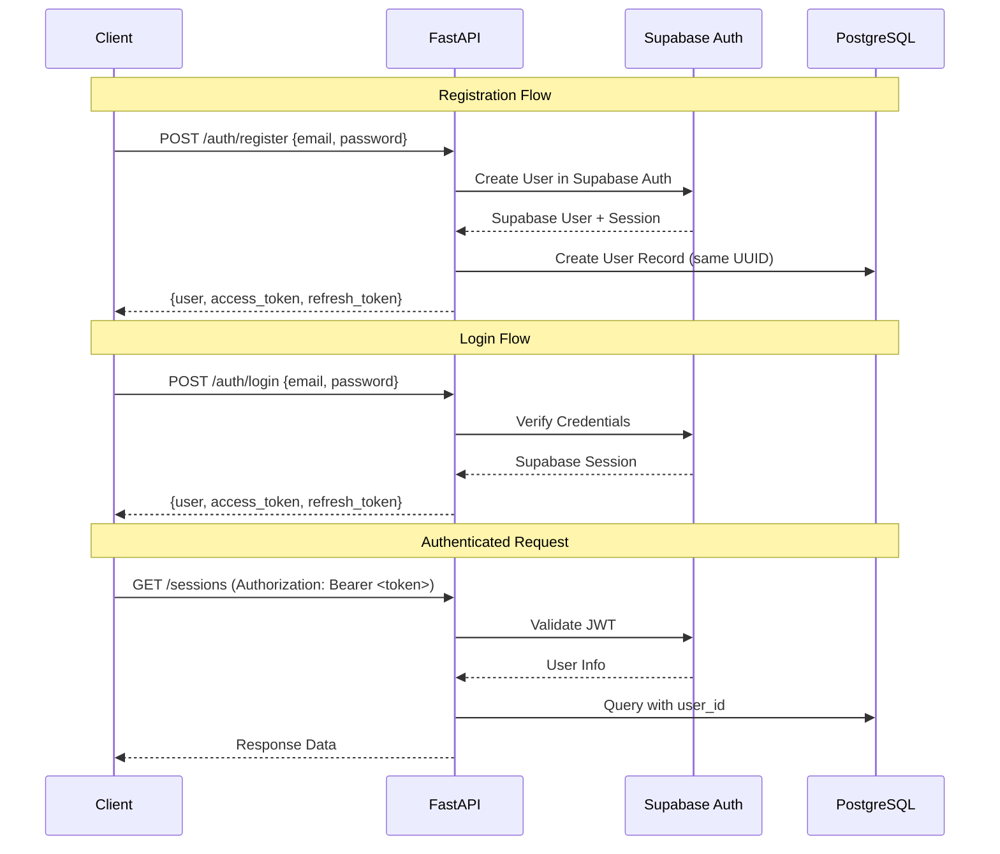

**Why Supabase Auth?**
- No need to implement JWT generation/validation
- Built-in refresh token handling
- Social login ready (Google, GitHub, etc.)
- User ID syncs with our database

---

## The Three Modes

### Mode Comparison

```mermaid
graph TB
    subgraph "TUTOR MODE"
        T1[User Question]
        T2[Vector Search RAG]
        T3[Augmented Prompt]
        T4[Gemini Response]
        T1 --> T2 --> T3 --> T4
    end

    subgraph "PRACTICE MODE"
        P1[User Message]
        P2[Persona Context]
        P3[Roleplay Prompt]
        P4[OpenRouter Response]
        P1 --> P2 --> P3 --> P4
    end

    subgraph "ANALYSIS MODE"
        A1[Screenshot + Question]
        A2[Vision + RAG]
        A3[Analysis Prompt]
        A4[3 Reply Suggestions]
        A1 --> A2 --> A3 --> A4
    end
```

### Tutor Mode

**Purpose**: Answer questions based on uploaded dating guides

**Flow**:
1. User asks a question
2. System searches vector DB for relevant chunks
3. Chunks are injected into prompt as context
4. Gemini generates answer grounded in the knowledge base

**System Prompt Highlights**:
- "Base your answers on the provided knowledge context"
- "Be direct and practical - give specific examples"
- "Never be preachy or lecture - be a helpful friend"

### Practice Mode

**Purpose**: Roleplay conversations with customizable AI personas

**Persona Settings**:
```json
{
  "name": "Alex",
  "age": 25,
  "gender": "female",
  "vibe": "flirty but hard to get",
  "backstory": "Met at a coffee shop",
  "scenario": "First date texting"
}
```

**System Prompt Highlights**:
- "Stay completely in character"
- "Never mention you're an AI"
- "React realistically - show interest, get annoyed, flirt"
- Uses OpenRouter for uncensored responses

### Analysis Mode

**Purpose**: Analyze real chat screenshots and suggest replies

**Output Format**:
```
**ANALYSIS:**
[Conversation dynamics analysis]

**REPLY OPTIONS:**
🔥 RISKY: [Bold, could backfire]
😂 FUNNY: [Witty, humor-based]
✅ SAFE: [Reliable, low-risk]
```

**Features**:
- Multimodal (accepts images)
- Uses RAG for context from dating guides
- Returns structured suggestions

---

## RAG Pipeline

### Document Processing Flow

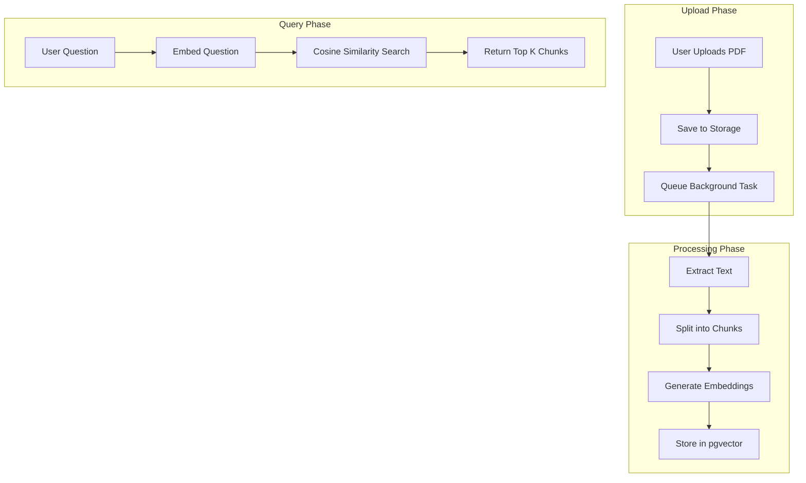

### Chunking Strategy

```python
# Parameters
chunk_size = 1000      # Characters per chunk
chunk_overlap = 200    # Overlap for context continuity

# Strategy
1. Split by paragraphs (double newlines)
2. Accumulate until chunk_size exceeded
3. Save chunk with overlap from previous
4. Repeat until document processed
```

**Why this approach?**
- Paragraph-aware splitting preserves semantic units
- Overlap ensures context isn't lost at boundaries
- ~1000 chars ≈ 250 tokens, fits well in context windows

### Vector Search Query

```sql
SELECT 
    id, filename, content,
    1 - (embedding <=> :query_embedding) as similarity
FROM documents
WHERE 
    user_id = :user_id
    AND status = 'completed'
    AND 1 - (embedding <=> :query_embedding) > 0.5
ORDER BY embedding <=> :query_embedding
LIMIT 5
```

**Key Points**:
- `<=>` is pgvector's cosine distance operator
- We convert distance to similarity: `1 - distance`
- Threshold of 0.5 filters low-quality matches
- Limited to user's own documents for privacy

---

## Deployment Architecture

### Container Design

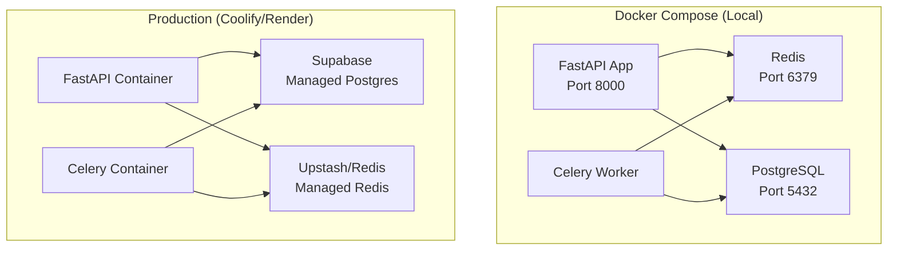

### Environment-Based Configuration

```python
# Deployment-agnostic design
settings = Settings()  # Reads from environment

# Works on any platform that injects env vars:
# - Coolify: Set in dashboard
# - Render: Environment tab
# - Railway: Variables section
# - Docker: -e flags or .env file
```

### Health Checks

| Endpoint | Purpose |
|----------|---------|
| `/health` | Full health with service status |
| `/health/live` | Liveness probe (app running) |
| `/health/ready` | Readiness probe (dependencies ready) |

---

## Design Decisions

### Why FastAPI over Django/Flask?

| Aspect | FastAPI | Django | Flask |
|--------|---------|--------|-------|
| Async Native | ✅ Yes | ⚠️ Limited | ❌ No |
| Auto API Docs | ✅ Yes | ❌ No | ❌ No |
| Type Hints | ✅ Required | ⚠️ Optional | ❌ Minimal |
| Performance | ✅ High | ⚠️ Medium | ⚠️ Medium |

**Decision**: FastAPI's async support is essential for non-blocking LLM API calls.

### Why Supabase over Firebase/Auth0?

| Aspect | Supabase | Firebase | Auth0 |
|--------|----------|----------|-------|
| PostgreSQL | ✅ Native | ❌ NoSQL | ❌ N/A |
| pgvector | ✅ Supported | ❌ No | ❌ No |
| Free Tier | ✅ Generous | ✅ Yes | ⚠️ Limited |
| Self-hostable | ✅ Yes | ❌ No | ❌ No |

**Decision**: Supabase provides Postgres + Auth in one, with pgvector for RAG.

### Why pgvector over Pinecone/Weaviate?

| Aspect | pgvector | Pinecone | Weaviate |
|--------|----------|----------|----------|
| Cost | ✅ Free | ❌ Paid | ⚠️ Hosted |
| SQL Integration | ✅ Native | ❌ Separate | ❌ Separate |
| Transactions | ✅ Yes | ❌ No | ❌ No |
| Managed Option | ✅ Supabase | ✅ Yes | ✅ Yes |

**Decision**: pgvector keeps everything in one database, simplifying ops.

### Why OpenRouter for Practice Mode?

| Aspect | OpenRouter | OpenAI | Anthropic |
|--------|------------|--------|-----------|
| Uncensored Models | ✅ Many | ❌ No | ❌ No |
| Cost | ✅ Cheap | ⚠️ Medium | ⚠️ Medium |
| Model Variety | ✅ 100+ | ⚠️ Few | ⚠️ Few |

**Decision**: Practice mode needs uncensored models for realistic romantic roleplay.

---

## Configuration Reference

### Required Environment Variables

```bash
# Application
APP_NAME=Rizzler
APP_ENV=development|staging|production
DEBUG=true|false
SECRET_KEY=<random-string>

# Supabase
SUPABASE_URL=https://xxx.supabase.co
SUPABASE_PUBLIC_KEY=<anon-key>
SUPABASE_SECRET_KEY=<service-role-key>
DATABASE_URL=postgresql+asyncpg://...

# AI Providers
OPENAI_API_KEY=sk-...
GOOGLE_API_KEY=...
OPENROUTER_API_KEY=sk-or-...

# Optional
REDIS_URL=redis://localhost:6379/0
```

### Model Configuration

```bash
# Embeddings
EMBEDDING_MODEL=text-embedding-3-small
EMBEDDING_DIMENSIONS=1536

# Chat Models
TUTOR_MODEL=gemini-1.5-flash
PRACTICE_MODEL=mythomax-l2-13b
```

---

## Future Improvements

1. **WebSocket Support**: Real-time typing indicators
2. **Conversation Summarization**: Compress long sessions
3. **Voice Input/Output**: Speech-to-text and TTS
4. **Fine-tuned Models**: Custom dating coach model
5. **Analytics Dashboard**: Track user progress
6. **A/B Testing**: Compare reply suggestion effectiveness

---

*Document generated for Rizzler v0.1.0*
*Last updated: December 2024*

